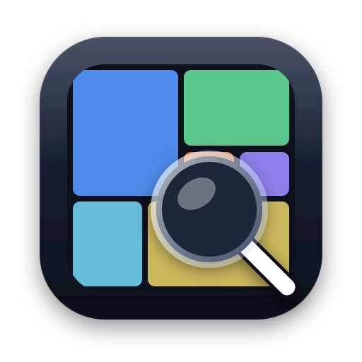
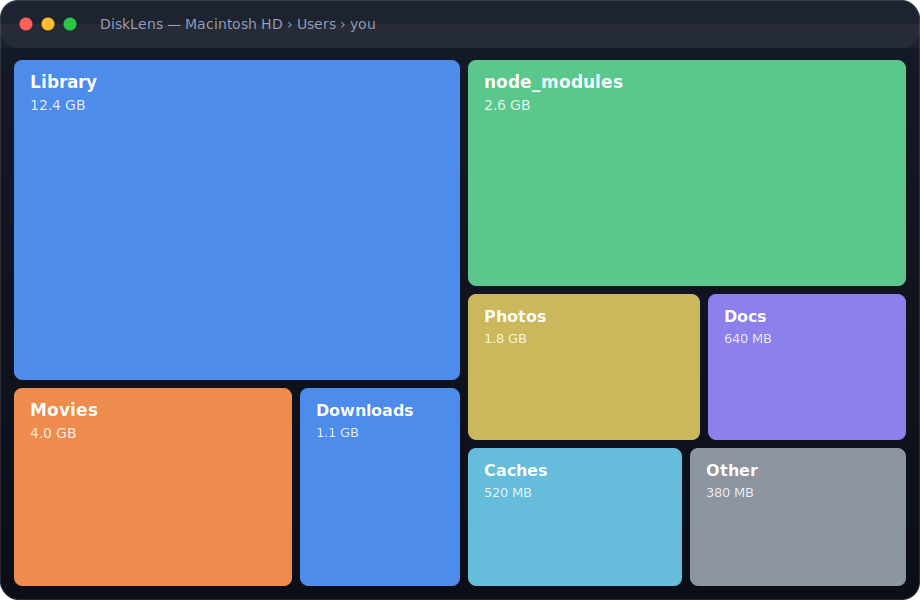

<div align="center">



# DiskLens

**See what's eating your Mac's disk — then reclaim it.**

A fast, native macOS app that scans any folder and shows exactly where your space went: a visual treemap, a duplicate finder, a largest-files view, and one-click cleanup. No Electron. Nothing leaves your Mac.

[](LICENSE)


[**🌐 Live site**](https://disklens-site.vercel.app) · [**⬇ Download (.dmg)**](https://disklens-site.vercel.app/downloads/DiskLens.dmg) · [**☕ Donate**](https://www.buymeacoffee.com/f0rkr)



</div>

---

## ✨ Features

| | Feature | What it does |
|---|---|---|
| 📊 | **Overview** | Total usage, a colorful by-type donut, and your largest items at a glance. |
| 🗂 | **Folder breakdown** | Drill into any folder as a tree, sorted largest-first, with size bars and a search filter. |
| 🟦 | **Visual treemap** | Each rectangle's area is its disk usage — big space-eaters pop out. Click any tile to zoom in. |
| 📄 | **Largest files** | The single biggest files anywhere, ranked — with an **"old & large"** filter (big files untouched 1y+). |
| 📑 | **Duplicate finder** | Byte-identical files found via SHA-256 (size-bucketed first, so it's fast), with reclaimable space. |
| ✨ | **Smart cleanup** | Flags caches, `node_modules`/build dirs, junk (`.DS_Store`), and big archives → moves them to the Trash. |

**Also:**

- 🧭 **Menu-bar overview** — free space at a glance, plus quick scan, right from the menu bar.
- 👁 **Quick Look + Undo** — preview any file inline; undo a cleanup instantly (everything goes to the Trash, never an unrecoverable delete).
- 🎯 **Drag & drop** a folder onto the app to scan it. **Recent folders** for one-click re-scans.
- ⚙️ **Preferences** — decimal/binary units, cleanup thresholds, and keyboard shortcuts (⌘O / ⌘R / ⌘,).
- 🪶 Native & **tiny** (under 1 MB), **100% on-device**, free and open source.

## 🔍 How it works

- **Scan engine** (`Models/ScanEngine.swift`) walks the directory tree with `FileManager`, summing **allocated** size (`totalFileAllocatedSize` — real on-disk usage) and **never follows symlinks**, so nothing is double-counted. It's cancellable and reports live progress.
- **Aggregation** (`Models/ScanInsights.swift`) computes the by-type donut, largest items, and largest files **off the main actor** after a scan, so the UI never walks the tree while rendering.
- **Treemap** is a **squarified** layout (Bruls–Huizing–van Wijk, `Utilities/Squarify.swift`) drawn in a single `Canvas` for speed, with exact point-in-rect hit-testing.
- **Duplicates** (`Models/DuplicateFinder.swift`) bucket files by size first, then compare candidates with a streaming **SHA-256** (CryptoKit) so large files never load fully into memory.
- **Cleanup** (`Models/CleanupRules.swift`) is rule-based and only ever moves items to the **Trash** (recoverable).

## 📦 Tech & packages

**App** — pure **SwiftUI**, zero external dependencies. Uses only Apple system frameworks:
`SwiftUI`, `AppKit`, `Charts` (Swift Charts), `CryptoKit`, `Foundation`, `Quartz`/Quick Look.
Built with `swiftc` directly (no Xcode required — Command Line Tools is enough) and bundled into a `.app` by hand.

**Website** (`web/`) — **Next.js 16** + **React 19**, hand-written CSS (no UI framework), deployed on **Vercel**.

## 🚀 Install

**Download:** grab the latest [`DiskLens.dmg`](https://disklens-site.vercel.app/downloads/DiskLens.dmg), open it, and drag **DiskLens** into **Applications**.

> **First launch (it isn't notarized yet):** macOS will block it the first time. Open **System Settings → Privacy & Security**, scroll down, and click **Open Anyway**. Or run once:
> ```bash
> xattr -dr com.apple.quarantine /Applications/DiskLens.app
> ```

## 🛠 Build from source

Requires macOS 14+ and the Swift toolchain (`xcode-select --install` — no full Xcode needed).

```bash
cd app
./build-app.sh      # compiles & bundles DiskLens.app
open DiskLens.app
# or run straight from source:
./run.sh
# package a distributable disk image:
./make-dmg.sh       # → DiskLens.dmg
```

`notarize.sh` is included for signing + notarizing if you have an Apple Developer ID.

## 📁 Project structure

```
.
├── app/          # native macOS app (SwiftUI)
│   ├── Sources/DiskLens/   # App, Models, Views, Utilities
│   ├── build-app.sh run.sh make-dmg.sh notarize.sh
│   └── Package.swift
├── web/          # Next.js landing site (deployed to Vercel)
└── docs/         # images
```

## 🌍 Environments (Vercel)

The website deploys to three environments:

| Environment | Trigger | URL |
|---|---|---|
| **Production** | push to `main` | https://disklens-site.vercel.app |
| **Staging** | push to `staging` | Vercel preview URL for the branch |
| **Development** | `npm run dev` / `vercel dev` (local) | http://localhost:3000 |

Each carries a `NEXT_PUBLIC_APP_ENV` variable (`production` / `staging` / `development`) so the build knows where it's running.

```bash
cd web
npm install
npm run dev      # development
```

## 🤝 Contributing

Issues and PRs welcome. The app has no external dependencies, so `cd app && ./run.sh` is all you need to start hacking.

## ☕ Support

DiskLens is free and open source. If it cleared up some gigabytes for you, you can [buy me a coffee](https://www.buymeacoffee.com/f0rkr).

## 📄 License

[MIT](LICENSE) © Ashad Mohamed
